# CareBridge

This is the readme file for the project CareBridge. You can find the detailed information about the project, features, and screenshots in this file.

## Technologies Used

- [Kotlin](https://kotlinlang.org/) - Programming Language
- [Firebase](https://firebase.google.com/) - Database
- [Android Studio](https://developer.android.com/studio) - IDE
- [Figma](https://www.figma.com/) - Design Tool

## Project Description

The project CareBridge is a mobile application that aims to bridge the gap between the elderly and their family members. The app has 3 modules:
Family and Friends Module, Senior Citizen Module, and Volunteer Module.

The application is designed to provide a platform for the elderly to connect with their family members and caregivers. The senior citizens can add their daily needs, such as medication reminders, doctor appointments, and grocery lists, to the application. The family members get notified about these needs and can help the elderly with their daily tasks.

The family members can also create a profile for the elderly or connect with the elderly using an email. The application also has Fall Detection and Emergency Alert features that can be used by the elderly in case of an emergency. The app sends a notification along with the location of the elderly to the family members upon detection of fall.

The application also has a Volunteer Module that allows volunteers to connect with the elderly and help them with their daily tasks. The volunteers can share their availability based on which the family/senior citizen member can book an appointment with the volunteer.

## Features

1. **Family and Friends Module**

   - Create a profile for the elderly
   - Connect with the elderly using an email
   - Get notified about the daily needs of the elderly
   - Help the elderly with their daily tasks
   - Get notified about the fall detection and emergency alerts
   - View the location of the elderly in case of an emergency

2. **Senior Citizen Module**

   - Add daily needs such as medication reminders, doctor appointments, and grocery lists
   - Get notified about the daily needs
   - Use the fall detection and emergency alert features
   - Book an appointment with a volunteer

3. **Volunteer Module**
   - Share availability
   - Check the appointments booked by the family/senior citizen members
   - Help the elderly with their needs

## Screenshots and Results

### Login & Sign-Up

  <!-- 

  

 -->
  

  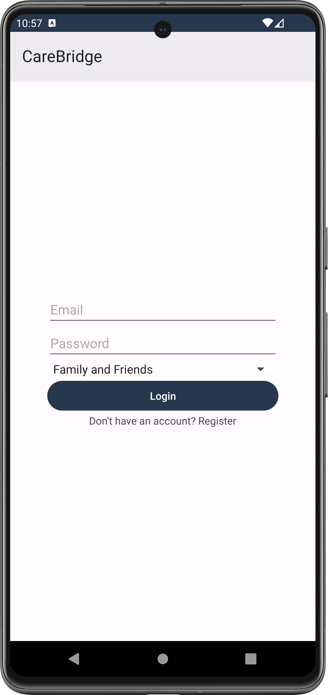
  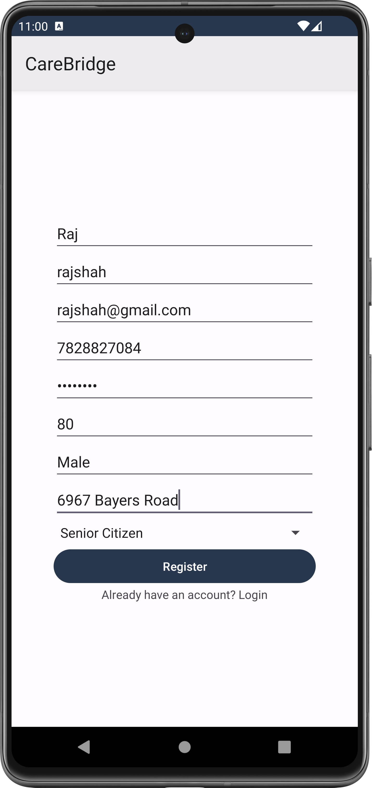
  

### Senior - Add Items

  

  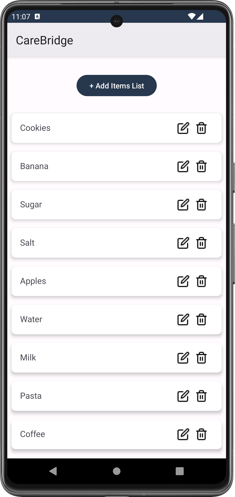
  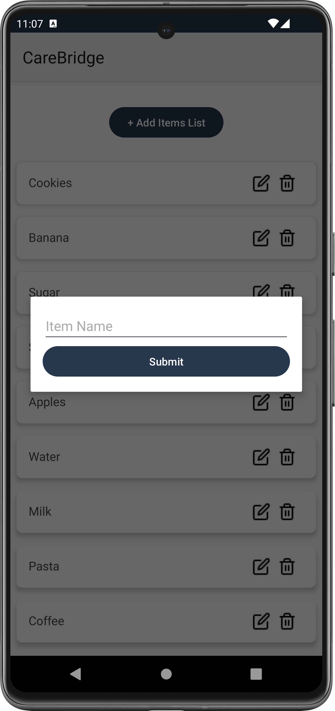
  

  

  

### Senior - Navigation Menu

  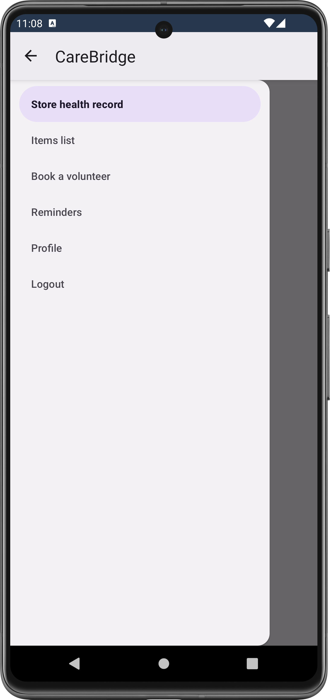

### Senior - Reminder

  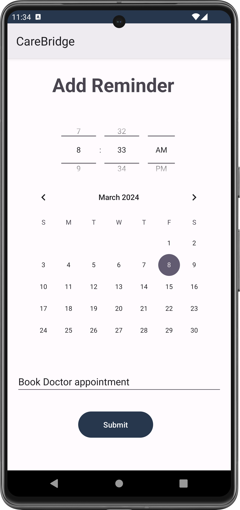

### Volunteer

  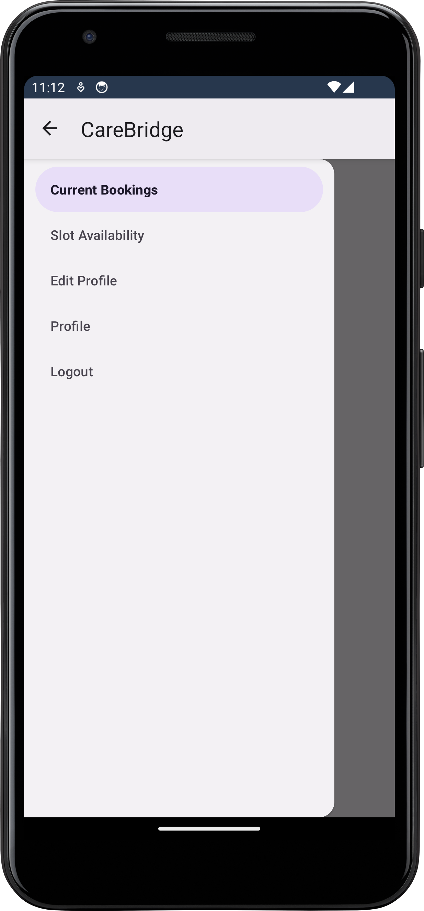

### Volunteer - Profile

 

  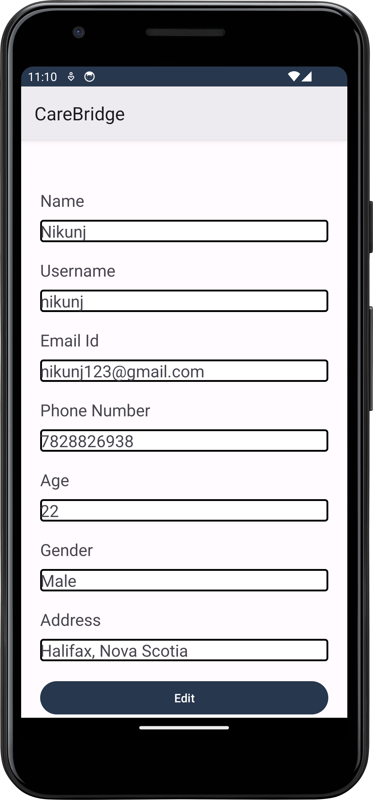
  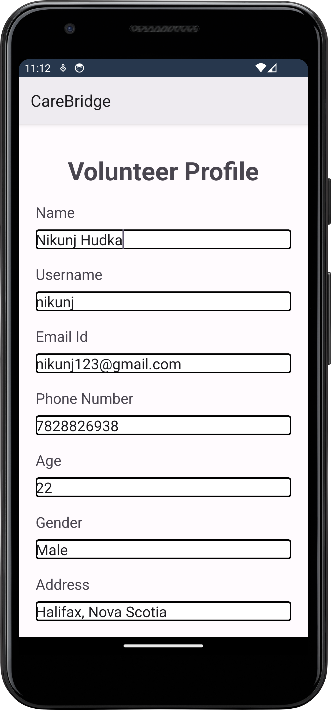
  

### Volunteer - Slot Availibility

  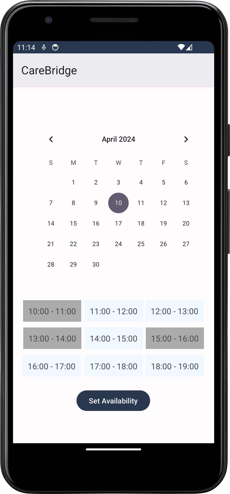

### Volunteer - Current Booking

  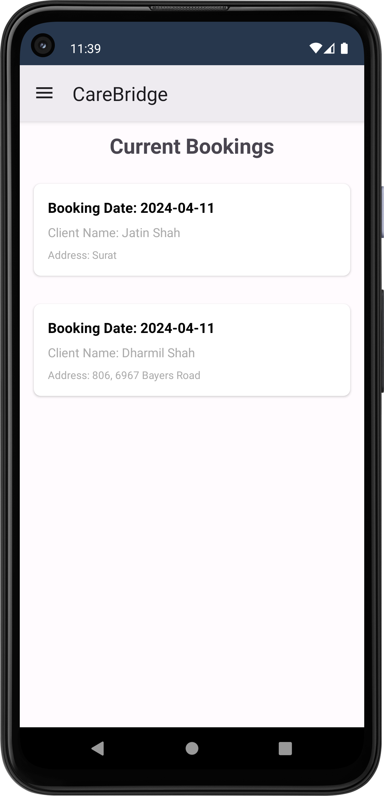

### Family, Friends - No Senior citizen added

  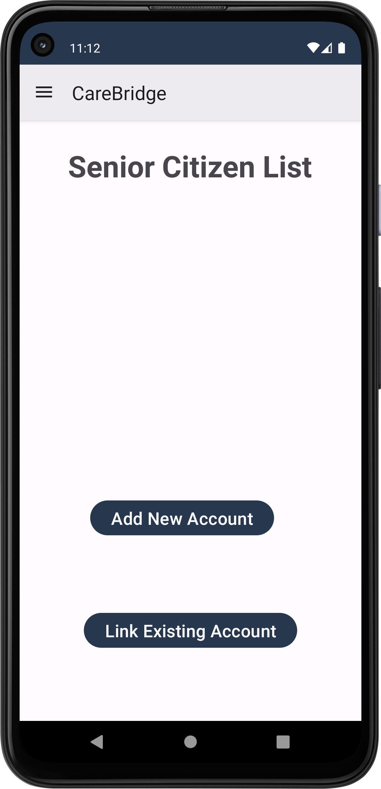

### Family, Friends - Add existing senior citizen

  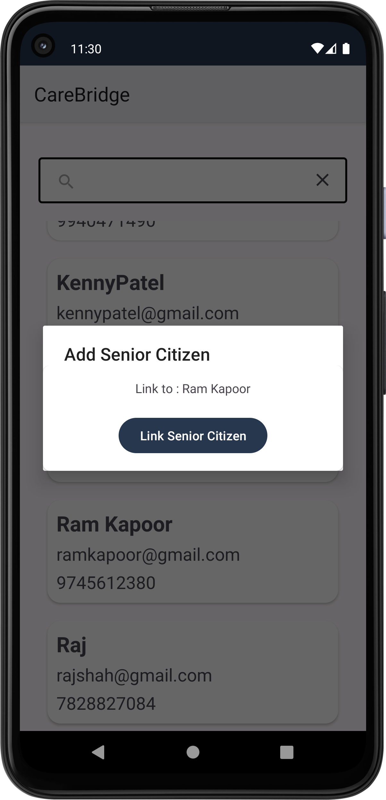

### Family, Friends - existing senior citizen (Search & list)

  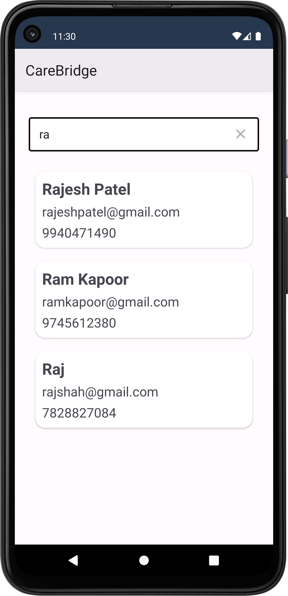

### Family, Friends - Add new senior citizen

  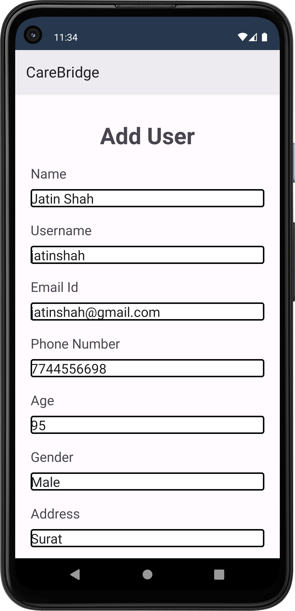

### Family, Friends - Added senior citizen

  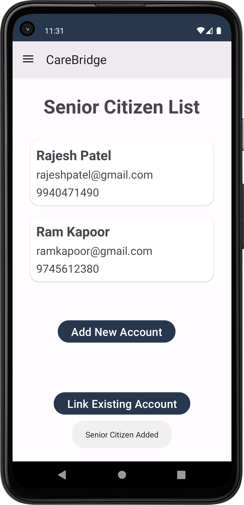

### Family, Friends - Profile

  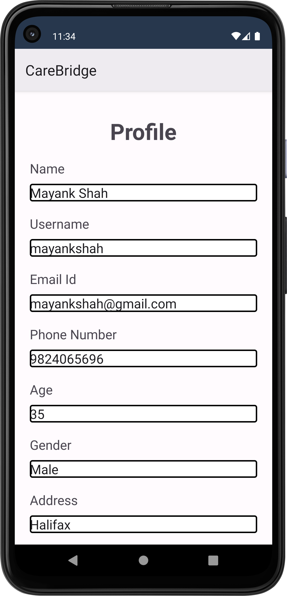

## References

- [Focused Client](https://developers.google.com/android/reference/com/google/android/gms/location/FusedLocationProviderClient) - Google Developers
- [Location GMS](https://developers.google.com/android/reference/com/google/android/gms/location/package-summary) - Google Developers
- [Location Sensor](https://developer.android.com/develop/sensors-and-location/location) - Android Developers
- [Location Permissions](https://developer.android.com/develop/sensors-and-location/location/permissions) - Android Developers
- [Kotlin Coroutines](https://developer.android.com/kotlin/coroutines) - Android Developers
- [Send Notification](https://youtu.be/YjNZO90yVsE?si=KARP4pcDBxQHCtAw) - YouTube
- [Schedule Reminder](https://www.youtube.com/watch?v=mWb_hEBLIqA&t=681s&pp=ygUcc2NoZWR1bGUgcmVtaW5kZXIgaW4gYW5kcm9pZA%3D%3D) - YouTube
- [Fall Detection Using Smartphone-Based Application – Research Paper](https://www.researchgate.net/publication/334093265_Fall_Detection_Using_Smartphone-Based_Application) - Research Gate
- [SensorManager](https://developer.android.com/reference/android/hardware/SensorManager) - Android Developers
- [Firebase Storage for pdf](https://firebase.google.com/docs/storage/android/upload-files) - Firebase Documentation
- [Broadcast Receiver – Boot Completed](https://www.geeksforgeeks.org/broadcast-receiver-in-android-with-example/) - GeeksforGeeks
- [Foreground Service](https://developer.android.com/develop/background-work/services/foreground-services) - Android Developers
